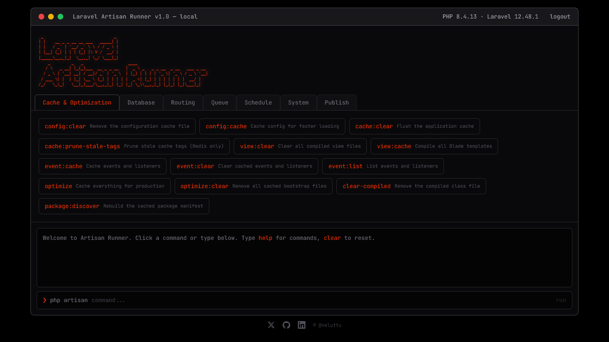

# Laravel Artisan Runner v1.0

Run Laravel Artisan commands directly from your browser — built for **shared hosting (cPanel)** environments where you have **no SSH access**, **no terminal**, and **no command line**.

If you deploy Laravel on shared hosting providers like Bluehost, Hostinger, Namecheap, SiteGround, GoDaddy, A2 Hosting, or any cPanel-based host, you know the struggle: there's no way to run `php artisan migrate`, clear cache, or manage your application without SSH. **Artisan Runner solves this.**

A single PHP file. Drop it in `public/`. Open it in your browser. Done.




## The Problem / Problema

**EN:** Most shared hosting plans with cPanel don't provide SSH access. You can upload files via FTP or File Manager, but you can't open a terminal to run Artisan commands. This means you can't run migrations, clear cache, seed the database, list routes, or put your app in maintenance mode — things that are essential for managing a Laravel application.

**RO:** Majoritatea planurilor de shared hosting cu cPanel nu ofera acces SSH. Poti incarca fisiere prin FTP sau File Manager, dar nu poti deschide un terminal ca sa rulezi comenzi Artisan. Asta inseamna ca nu poti rula migratii, sterge cache-ul, popula baza de date, lista rutele sau pune aplicatia in modul mentenanta — lucruri esentiale pentru administrarea unei aplicatii Laravel.

## The Solution / Solutia

**EN:** Artisan Runner is a **single PHP file** that acts as a web-based terminal for your Laravel application. It bootstraps Laravel, executes whitelisted Artisan commands, and displays the output — all from your browser. No SSH required. No additional packages. No configuration. Just upload and use.

**RO:** Artisan Runner este un **singur fisier PHP** care functioneaza ca un terminal web pentru aplicatia ta Laravel. Incarca framework-ul Laravel, executa comenzile Artisan permise si afiseaza rezultatul — totul din browser. Fara SSH. Fara pachete suplimentare. Fara configurare. Doar il incarci si il folosesti.

## Features

- **Single file** — drop `artisan-runner.php` into your `public/` folder and you're ready to go
- **No SSH required** — run Artisan commands from any browser, on any device
- **cPanel compatible** — works on any shared hosting with PHP and Laravel
- **Terminal aesthetic** — dark UI with JetBrains Mono font and scanline effects
- **Password protection** — session-based authentication with configurable password and 2-hour timeout
- **No page refresh** — commands execute via AJAX using Alpine.js
- **Command history** — navigate previous commands with arrow keys (up/down)
- **Destructive command alerts** — confirmation dialogs before running dangerous commands
- **Organized by category** — tabbed interface: Cache, Database, Routing, Queue, Schedule, System, Publish
- **Route table rendering** — `route:list` output displayed as a structured HTML table
- **60+ whitelisted commands** — all standard Artisan commands, safely curated

## Requirements

- PHP 8.1+
- Laravel 10, 11, or 12
- Web server (Apache/Nginx/LiteSpeed) pointing to Laravel's `public/` directory

## Installation

### EN

1. Download `artisan-runner.php`
2. Upload it to your Laravel project's `public/` directory (via cPanel File Manager or FTP):

```
your-laravel-project/
  public/
    artisan-runner.php   <-- here
    index.php
```

3. Open the file and change the password on line 13:

```php
define('RUNNER_PASSWORD', 'your-secure-password-here');
```

4. Access it in your browser:

```
https://your-domain.com/artisan-runner.php
```

### RO

1. Descarca `artisan-runner.php`
2. Incarca fisierul in directorul `public/` al proiectului Laravel (prin cPanel File Manager sau FTP):

```
proiectul-tau-laravel/
  public/
    artisan-runner.php   <-- aici
    index.php
```

3. Deschide fisierul si schimba parola de pe linia 13:

```php
define('RUNNER_PASSWORD', 'parola-ta-sigura');
```

4. Acceseaza in browser:

```
https://domeniul-tau.com/artisan-runner.php
```

## Use Cases / Cazuri de utilizare

- **Deploy Laravel on shared hosting** — run `migrate`, `optimize`, `storage:link` after uploading your code
- **Clear cache after updates** — `config:clear`, `cache:clear`, `view:clear` when you update `.env` or Blade files
- **Database management** — run migrations, rollbacks, seeders without phpMyAdmin raw SQL
- **Debug routing** — view all registered routes with `route:list`
- **Maintenance mode** — put the app `down` / `up` for deployments
- **Queue management** — restart workers, view failed jobs, flush queues

## Available Commands

| Category | Commands |
|---|---|
| **Cache & Optimization** | `config:clear`, `config:cache`, `cache:clear`, `view:clear`, `view:cache`, `event:cache`, `event:clear`, `event:list`, `optimize`, `optimize:clear`, `clear-compiled`, `package:discover`, `cache:prune-stale-tags` |
| **Database** | `migrate`, `migrate:status`, `migrate:install`, `migrate:rollback`, `migrate:fresh`, `migrate:fresh --seed`, `migrate:refresh`, `migrate:reset`, `db:seed`, `db:show`, `db:wipe`, `schema:dump` |
| **Routing** | `route:list`, `route:list --except-vendor`, `route:list --only-vendor`, `route:clear`, `route:cache`, `channel:list` |
| **Queue** | `queue:restart`, `queue:clear`, `queue:failed`, `queue:flush`, `queue:monitor`, `queue:pause`, `queue:resume`, `queue:prune-batches`, `queue:prune-failed`, `queue:work --once` |
| **Schedule** | `schedule:list`, `schedule:run`, `schedule:clear-cache`, `schedule:interrupt` |
| **System** | `about`, `env`, `storage:link`, `storage:unlink`, `down`, `up`, `key:generate`, `auth:clear-resets`, `model:prune` |
| **Publish** | `config:publish`, `lang:publish`, `stub:publish`, `vendor:publish` |

## Destructive Command Protection

Commands that can cause data loss or service disruption show a confirmation dialog before execution. These include:

- `migrate:fresh`, `migrate:reset`, `migrate:refresh`, `db:wipe` — database destruction
- `migrate`, `migrate:rollback`, `db:seed` — database changes
- `cache:clear`, `optimize:clear` — cache removal
- `queue:clear`, `queue:flush` — job deletion
- `down` — maintenance mode
- `key:generate` — app key regeneration (breaks encrypted data)
- `model:prune` — permanent model deletion

## Security

- **Change the default password** before deploying
- Session-based authentication with 2-hour automatic timeout
- Only whitelisted commands can be executed — arbitrary commands are blocked
- Consider deleting the file after use, or restricting access via `.htaccess`
- Add to `.gitignore` if you don't want it in your repository

### Restricting Access via .htaccess

```apache
<Files "artisan-runner.php">
    Require ip 123.456.789.0
</Files>
```

## Keywords

`laravel shared hosting`, `laravel cpanel`, `artisan without ssh`, `laravel no ssh`, `run artisan commands browser`, `laravel hosting fara ssh`, `cpanel laravel deploy`, `laravel web terminal`, `php artisan web ui`, `laravel shared hosting migration`, `laravel cpanel migrate`, `laravel artisan gui`, `run php artisan without terminal`, `laravel cpanel no ssh access`, `deploy laravel shared hosting cpanel`, `laravel gazduire partajata`, `comenzi artisan fara ssh`, `laravel fara terminal`

## Built With

- [Tailwind CSS](https://tailwindcss.com/) (CDN) — styling
- [Alpine.js](https://alpinejs.dev/) (CDN) — reactivity and AJAX
- [JetBrains Mono](https://www.jetbrains.com/lp/mono/) — terminal font

## License

MIT License

---

Copyright (c) [@neluttu](https://github.com/neluttu)

[](https://x.com/neluttu)
[](https://github.com/neluttu)
[](https://linkedin.com/in/ionel-olariu)
